Introduction
------------

The ability for scientists, students, and citizens to easily visualize and analyze spatial data is more crucial than ever. As the amount of freely available geo-referenced data continues to grow, an ever-increasing community is discovering and utilizing spatial information\[1\]. A host of commercial and open source software with point-and-click interfaces exist for spatial analysis and visualization-- from ESRI's software suite to QGIS, Google Maps and other online options\[2\]. For those who wish to move beyond the graphical user interface, open-source languages such as R and Python are no longer restricted to those with academic or computer science backgrounds. Massive online open courses, an extensive blogging community, and online forums such as StackExchange provide instruction and trouble-shooting help from any corner of the world. The barriers to a truly participatory geographic information science (GIS) community are being lowered. This explosion of free resources empowers citizen scientists, grassroots organizations, and institutions in low-resource settings to take advantage of the ever-growing library of open-source toolkits for data science. R, as an open-source programming language used extensively for data analysis and statistics, has a variety of tools designed for spatial analysis and visualization\[3\]\[4\].

Working with spatial data is not, however, straightforward. Full of idiosyncrasies such as varying data types, projections, and the threat of invalid geometries, there is an additional overhead to working with spatial data. This poses a challenge: how can users with less experience in programming and GIS be brought into the fold? The ability to present and visualize findings from any analysis is critical, and map-making has been shown to be a key tool. Empowered communities have the ability to present maps to decision makers, leading to policy changes\[5\].

The **MapSuite** package joins a community of prior work on mapping in R. In addition to the **sp** package\[4\], which contains both spatial data types and simple plotting functions, a variety of packages focus on spatial data visualization. Finely-customized graphics of many kinds are possible using **ggplot2**\[6\], which offers a number of data-driven plotting functions. Mapping-specific packages, such as **ggmap**\[7\] , **ggspatial**\[8\] , **rCarto**\[9\] , and **choroplethR**\[10\], each present ways for R users to visualize spatial data. However, none of the currently existing packages emphasize (i) the ability to map quickly and easily over time or subgroup, or (ii) the ability to layer complex maps to create a more sophisticated cartographic output. The growing popularity of interactive tools, such as **Leaflet** \[11\] and **Shiny**\[12\] , have changed the landscape of what it means to visualize multi-dimensional data. However, generating images and PDFs of results is still a key way to share and present results.

Many of the static graphics packages, such as **ggplot** and **ggmap**, utilize a paradigm established in R by Hadley Wickham called the "grammar of graphics"\[13\]. Within the "grammar of graphics," a plot is built in layers, where the data forms the foundation of the plot, and different geometric outputs (points, paths/lines, and polygons) can be layered and manipulated to generate a diagram. This approach to code has many advantages-- the syntax is highly flexible and well-suited to the kinds of data used by and produced from statistical analyses. There is also extensive documentation on how to use **ggplot2**, and how to achieve a variety of effects using this flexible package.

The MapSuite package uses the **ggplot2** library as a launching point for making maps, using three main functions (PolygonMap, PointMap, and RasterMap) as a wrapper for **ggplot2**'s geom\_polygon, geom\_point and geom\_raster geometries. Unlike building a plot from scratch in **ggplot2**, these functions demand relatively few inputs to create a pleasing choropleth map. The default settings of the MapSuite are designed to follow a set of graphical guidelines set forth by E.R. Tufte\[14\].

### Maximizing the data-to-ink ratio

Edward Tufte was well-known for the philosophy that effective graphics maximize information transfer while minimizing distractions. According to Tufte, in his book *The Visual Display of Quantitative Information*, the principles of graphical excellence are as follows:

> -   Show the data
> -   Induce the viewer to think about substance rather than about methodology, graphic design, the technology of graphic production, or something else
> -   Avoid distorting what the data have to say
> -   Present many numbers in a small space
> -   Make large data sets coherent
> -   Encourage the eye to compare different pieces of data
> -   Reveal the data at several levels of detail, from a broad overfiew to the fine structure
> -   Serve a reasonably clear purpose: description, exploration, tabulation, or decoration
> -   Be closely integrated with the statistical and verbal descriptions of a data set

The maps produced by the **MapSuite** package default settings are designed to follow these guidelines while lowering the burden on R users such that time can be spent on the data and analysis, not the plotting code. The sections that follow will introduce functions available in the **MapSuite** package, and discuss how the default settings for these functions are designed to follow Tufte's guidelines. First, examples of basic maps of point, raster, and polygon objects will provide an orientation to the parameters required by the **MapSuite** functions. Next, mapping categorical and numeric variables will be presented. An exploration of the challenges of merging spatial data and data.frames in R will provide context for why the **MapSuite** functions take external data sets as an optional parameter. After discussing the role of color in cartography, and showcasing a new set of easily accessible color ramps, the paper will introduce a function that generates histograms following the same color scheme as the map in order to understand the data's non-spatial distribution properties. Finally, the **MapSuite** functions that facilitate mapping over multiple dimensions (such as subgroup or time), and the layering and stacking of map layers will be revealed.

For the purposes of this introduction to the MapSuite package, the following data sets will be used:

-   county\_polygons
    -   A SpatialPolygonsDataFrame of county boundaries
-   county\_centroids
    -   A data.table with coordinates for county centroids
-   county\_pixels
    -   A data.table with coordinates on a regular grid
-   county\_simulated\_time
    -   A data.table of simulated data at the county level

Each of the polygons, centroids, and pixels objects contain columns with a unique identifier ('cnty'), and columns for state name ('state\_name'), and the mean elevation of the county ('elevation'). The data and spatial objects can be subset by state name, allowing for graphics focusing on a particular area (the states of Washington and Colorado are emphasized in these examples). Subsets of these data sets for individual states are also used.

Showing the data: plotting basic geometries and variables
---------------------------------------------------------

Before mapping a variable, it is sometimes useful to visualize the spatial objects themselves.

The required inputs to each of the main functions (PolygonMap, PointMap, and Rastermap) are minimal, and are as follows:

**Required Inputs**

-   PolygonMap
    -   map = a SpatialPolygonsDataFrame with a field in the @data slot that can serve as a unique identifier
    -   id = the name of the unique ID field in the @data slot
-   PointMap and RasterMap
    -   coords = a data.frame or data.table with a field that can serve as a unique identifier, and a column for the latitude and longitude of the points
    -   id = the name of the unique ID field within coords
    -   xcol = the name of the column in the coords data object that represents x or longitude
    -   ycol = the name of the column in the coords data object that represents y or latitude

By default, the functions will create maps with gray shapes, as could be used for a background map or preliminary data exploration.

``` r
PolygonMap(map=wa_polygons, id="cnty")
PointMap(coords=wa_centroids, id="cnty", xcol="x_albers", ycol="y_albers")
RasterMap(coords=wa_pixels, id="cnty", xcol="x_albers", ycol="y_albers")
```


<p class="caption">
Mapping Point, Polygon, and Raster Data
</p>

By adding optional parameters, various map aesthetics can be changed. The colors of the map (fill and outline in the case of polygons, fill alone in the case of points and rasters) can be modified. An outline layer (of class SpatialPolygons) that will lie atop your main map for context can be added and formatted.

``` r
PolygonMap(map=wa_polygons, id="cnty", map_colors = "lightgreen", 
           map_outline_color ="black")
PointMap(coords=wa_centroids,id="cnty", xcol="x_albers", ycol="y_albers",
         map_colors = "red", pointsize = 1, 
         outline = wa_polygons, outline_size = 1, outline_color = "black")
```

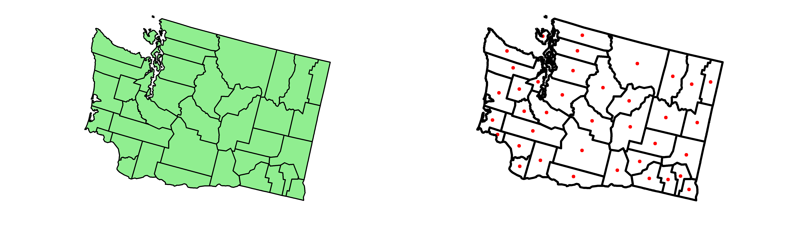
<p class="caption">
Changing basic map aesthetics and adding outline polygons
</p>

To achieve a stronger figure-ground effect where a certain area is visually emphasized, adding an outline of a different shape and color can be utlizied by passing a different SpatialPolygonsDataFrame to the outline parameter, or by passing only a subset of the SpatialPolygonsDataFrame used for the main map to the outline parameter.

``` r
Okanagan<-wa_polygons[wa_polygons@data[["cnty"]]==2944,]
PolygonMap(map=wa_polygons, id="cnty", map_colors = "lightblue", 
           outline = Okanagan, outline_size = 1, outline_color = "orange",
           map_title="Okanagan County")
```


<p class="caption">
Fig 3: Using outlines to add emphasis
</p>

Mapping a variable within the data attributes of the spatial object (within the data.frame that serves as the coordinates for the Point and Raster functions or within the @data slot of the SpatialPolygonsDataFrame in the PolygonMap function) is possible by adding a "variable" parameter. This variable can either be numeric or categorical in nature.

``` r
PolygonMap(map=county_polygons, 
           id="cnty", variable="elevation", 
           map_title="Mean Elevation")

county_polygons@data[,above_below:=ifelse(county_polygons@data[["elevation"]]>1000,
                                          "<1,000 ft",">1,000 ft")]
PolygonMap(map=county_polygons, 
           id="cnty", variable="above_below", 
           legend_title = "Mean Elevation")
```


<p class="caption">
Mapping binned and categorical data
</p>

Although providing a color range is not required (a default color scheme will portray the data), it is easy to change. It is also possible to label specific cut-points on the legend with values of interest, and modify font and legend properties.

``` r
PolygonMap(map=county_polygons, id="cnty", variable="elevation",
           map_colors=c("red","yellow","white","blue","violet"),
           map_title="United States", map_title_font_face = "bold", font_size = 8,
           map_subtitle ="Counties", font_family = "sans", 
           legend_title="Mean Elevation", legend_font_face = "italic", 
           legend_position = "right", legend_orientation="horizontal" ,
           legend_label_values = c("Sea Level","1 mile high"),legend_label_breaks =c(10,3250))
```

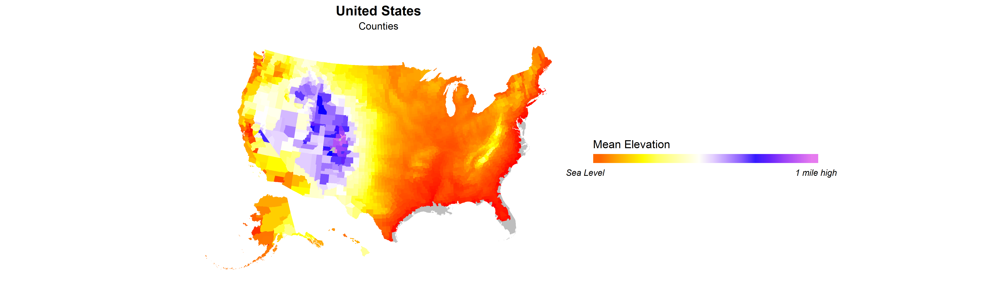
<p class="caption">
Changing color schemes and legend properties
</p>

For point data, a separate variable can be defined as the variable that describes the size of the points.

``` r
PointMap(coords=county_centroids, id="cnty", xcol="x_albers", ycol="y_albers", map_colors=wpal("betafish"),
         variable="elevation_range",legend_title = "Elevation Range",
         sizevar = "elevation", sizetitle = "Elevation", font_size = 6, 
         legend_position = "right", legend_orientation = "horizontal", legend_stacking="vertical")
```

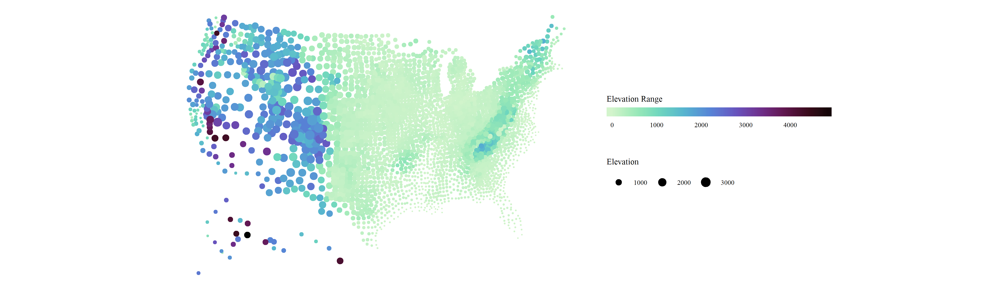
<p class="caption">
Modifying point size based on another variable
</p>

Allow the programmer to think about substance rather than about methodology
---------------------------------------------------------------------------

What if the variable you wish to plot is not already in same data object as the object you are using to plot the geometry's coordinates or boundaries (either a data.frame or SpatialPolygonsDataFrame)? Although a seemingly innocuous solution is to use one of R's base functions such as merge() to join spatial data with other attributes, this can prove to be problematic.

An under-appreciated quirk of the SpatialPolygonsDataFrame data type is that the geometry slot (@polygons) is related to the attributes (@data) by a shared ordering, where the first item in the @polygons slot has the attributes of the first item in the @data slot. If an R user wishes to map a variable not yet in the @data slot, the temptation is to use the merge() function to join the two data sets and carry on with plotting your spatial data. However, this approach is dangerous- unbeknownst to many, the merge() function re-orders the resulting data frame by the ID fields used to join the two data sets. This can lead to maps that look plausible (there are data values and attributes for each polygon), but the ordering of the @data slot no longer matches with the @polygons, leading to a map where attributes are mismatched with their geometries.

<!-- Scrambled Polygons Figure -->
\begin{minipage}{\linewidth}
\begin{center}
\includegraphics[width=\linewidth]{scrambled_poly}
\captionof{figure}{An example of how attributes can become dissasociated with their geometries based on a merge.}
\end{center}
\end{minipage}
To prevent this, the MapPolygons, MapPoints, and MapRaster functions take external data sets as parameters, which can be joined onto the spatial data using a specified field present in both the spatial and tabular data. The merging of the external data and the spatial objects within the PolygonMap function are ensured to preserve the polygon-to-attribute relationships. The polygon object is "fortified" (converted from a SpatialPolygonsDataFrame object into a data.frame with coordinate locations for plotting) within the function, and the additional data set is merged on. This syntax makes it easy to switch between different variables that exist in an external data set.

``` r
PolygonMap(map=county_polygons,data=county_simulated,
           id="cnty", variable="var1", map_title="Simulated Variable 1")
PolygonMap(map=county_polygons,data=county_simulated,
           id="cnty", variable="var2", map_title="Simulated Variable 2")
```


<p class="caption">
Mapping two different variables from an external data frame
</p>

Avoiding distoring what the data have to say
--------------------------------------------

The hue (pigment), saturation (intensity), and value (darkness) chosen to portray data can dramatically change their perception\[15\]. Color is an important consideration for any graphic-- however, it is especially crucial to consider when making maps due to the trust awarded to cartographers by the public. As Judith Tyner noticed in 1982, "map users, especially those who examine maps infrequently, tend to place inordinate faith in maps and accept them as true and complete representations"\[16\].

Research on the color choices that underpin readable maps and graphics has provided nuanced insight towards what kind of color palettes are most effective for representing numeric or sequential data. Broadly, three main categories of color scale exist: sequential, diverging, and categorical. Sequential palettes move through at least two colors, often going from light-to-dark (or vice versa). A diverging scheme passes through at least three colors, as two colors "diverge" from a shared middle ground. Categorical color schemes have no trajectory-- and are often chosen to be dissimilar from one another such that the reader can easily tell the difference between two categories. Broadly, sequential color schemes are used when the entire range of the data is important, but there is no central value with special significance that serves as a frame of reference. In contrast, diverging color schemes are recommended when the data have a meaningful central value that can be used as a frame of reference. This can be either a specific cutoff based on knowledge of values of relevance (such as values above and below 0, or a certain threshold), or based some parameter of the data (for example, mapping Z-scores that diverge from 0). One special case of the diverging color scheme is the "spectral scheme," alternatatively known as the "rainbow scheme," that passed through the full (or modified) color space of red-orange-yellow-green-blue-indigo-violet. Although some researchers argue against this rainbow color scheme\[17\], others have advocated its use in specific scenarios, such as the mapping of mortality rates, where map readers could easily differentiate between the low values colored in blue, and the higher values coded in red\[18\].

<!-- Color Palette Examples -->
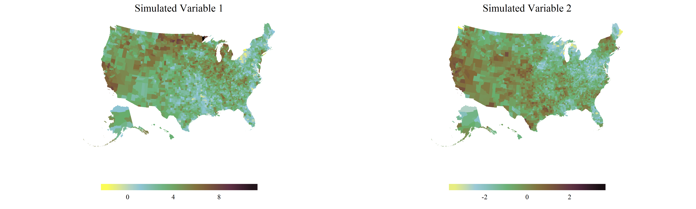

The "ColorBrewer" project of Cynthia Brewer, available in R through the package **RColorBrewer**\[19\] contains a variety of color schemes used regularly within the mapping community. However, the sequential palettes presented in RColorBrewer often do not contain more than two or three colors, limiting the differentiation possible between data values. A member of the astronomy community, Dave Green, developed the "cubehelix" algorithm to differentiate star-brightness values from observations of the night sky. The "cubehelix" is a virtual corkscrew moving through a cube of red-green-blue color space on a trajectory from dark to light\[20\]. This function has been adapted for R in the **rje** package\[21\], where users can define the following variables in order to produce a variety of diferent color palettes moving from dark to light: (i) the number of rotations, (ii) how large the radius of the corkscrew is, and (iii) the saturation. The permutations for color palettes that can be created with this function is nearly endless.

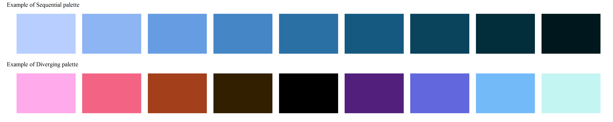

Within the **MapSuite** library, a series of curated sequential and diverging palettes derived from the cubehelix algorithm are contained within the wpal function. The **MapSuite**'s "Woodson Palettes" are lists of color values that can be called upon by both the main mapping functions and any other function that accepts a list of colors in R. Using the MapSuite's wpal function, users can specify a number of colors that will be interpolated, as well as whether black will be included (if it exists in the color palette). If you wish to explore or view a specific Woodson Palette's default colors, the ViewPal function will plot the desired color ramp. The PlotColors function allows the plotting of any list of colors, including a modified Woodson Palette.

``` r
ViewPal("seaglass",base_size=6)
```

    ## [1] "Plotting wpal color scheme seaglass"

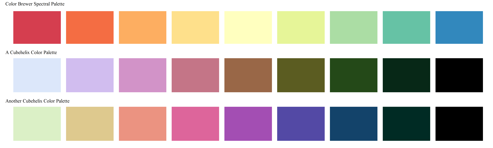

To use a Woodson Palette in reverse (re-ordered dark-to-light), the function rev() can be used sort the color pallette in reverse order.

``` r
more_colors<-rev(wpal("seaglass",n=12,noblack=T))
PlotColors(more_colors, color_list_name="Reversed Ramp with More Colors",base_size = 6)
```

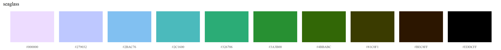

Our instinct to assign value judgments ("red is bad, blue is good") to color scales is simultaneously what makes them effective and conversely problematic. While there are some variables that can be clearly discerned as favorable and non-favorable (like mortality rates), visualizing quantities like the proportion of people belonging to a minority racial group on a similar color scale is far from appropriate. When visualizing a large quantity of data, where subtle spatial differences should be clear to the viewer, a diverging color palette that moves through three colors tends to add more clarity and visual precision than a sequential palette moving through only two. As such, there is the temptation to use diverging colors such as the spectral color scheme to represent data that may not have a meaningful central value, and may not have a clear "good" and "bad" connotation. For this reason, making color palettes based on a cubehelix color scheme that move from light to dark, rather than from a "good" color to a "bad" color, could serve an important purpose in visualizing data in social sciences. The default color scheme (called "earth"), moves in a sequence (yellow, blue, green, brown, purple, then black) designed to provide value differentiation without a moral or emotional value judgment. These scales, moving from light to dark, will also preserve the relationships between data values and pigment value, even when printed in black and white, and when viewed by the colorblind.

It is worth noting that the same color scale can look quite different based on the number of geometries or data points present-- while a color ramp that goes through many colors looks appropriate with large numbers of data points or geometries, too few can create a "chunky" or categorical look. In these circumstances, choosing a color palette with fewer colors may provide a more pleasing and readable map. To showcase the extent to which color and binning (converting a continuous variable to a categorical one) impact the visual appearance of data, the same data will be used in figures 9-12.

<!-- Examples of scary, non-scary palettes-->
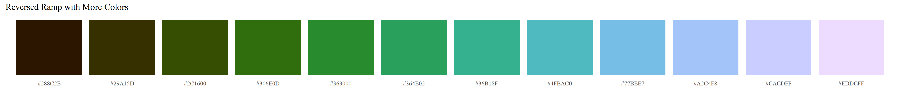
<p class="caption">
The same data, represented using three different color schemes
</p>

To explore these colors, and how they impact how data are portrayed, visit and explore [this online visualization tool](https://rebeccastubbs.shinyapps.io/woodson_shiny_example/), which contains a variety of color palettes that can be tested on different variables and for varying numbers of data points.

The default use of continuous color scales for numeric data is designed to minimize the visual bias that occurs from data classification into discrete groups, which can "reveal meaningful spatial trends or promote misleading interpretations" of the data\[22\]. Although different color schemes and ramps can emphasize or subdue patterns in the data, a continuous color scale that ranges through the minimum and maximum values is subject to one fewer source of bias-- the choice of what classification scheme to use. Classifying or binning data has the danger of making values that are similar appear distant from one another due to proximity to the breaks values, and the size and divisions used to create data categories can dramatically change the visual appearance of the data.


<p class="caption">
Two different binning methods
</p>

To define the minimum and maximum of the color scale separately from the minimum and maximum of the data variable you are mapping, a two-item vector (with a minimum and maximum) can be passed to the map\_colors\_limits parameter. For those who wish to highlight or emphasize some portion of the data without using binned categories, the parameter map\_color\_breaks allows users to change how the color ramp is applied to the range of the data. Note that this approach does not change the values, or the "truth" presented by the maps-- it simply changes how the colors are stretched across the minimum and maximum of the scale. However, these changes can dramatically change the *appearance* of the data.

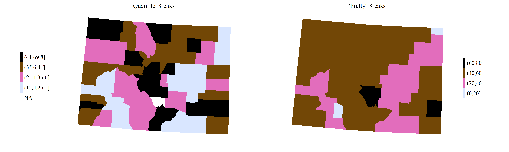
<p class="caption">
Changing how the colors are stretched across the data: (i) Evenly from the minimum to the maximum (top left), (ii) Artificially extending the range of the colors to 0-300, which is larger than the range of the data (top right), and (iii) Changing whether light or dark colors occupy more of the range of the data by shifting how the same colors are applied to the dataas in top left, or in a way where more dark or light colors cover the majority of the range (bottom)
</p>

If there is a meaningful central point or cutoff in your data, it is possible to set the numeric value that will serve as the central color in a diverging scale:


<p class="caption">
Using two different numeric values (20 and 50) to center the color scheme on a meaingful value
</p>

Present many numbers in a small space: color-coded histograms
-------------------------------------------------------------

While a good map can highlight spatial patterns, a histogram of the data being represented on the map illuminates the non-spatial trends in the distribution. As noted by Mark Monmonier, author of *How to Lie With Maps*, a secondary graphic that shows the data distribution is an important aspect of revealing the data's truth. He notes that "if the map author is at all concerned with full disclosure, a ...histogram... is a must"\[22\].

However, visually linking a histogram to a 2-dimensional spatial distribution can be difficult. To make the comparison of spatial distributions and densities, the function HistogramColorStats provides extra context by linking histogram color to choropleth color. In addition, references to properties of the distribution can be referenced in the form of colored lines that highlight data parameters. Users can pass a vector of statistical terms (currently supported are the mean, median, standard deviation, and any number of quantiles) to the function, which will provide even more visual cues to help understand the patterns in the data.

``` r
HistogramColorstats(datavector=county_simulated[["var2"]], color_ramp=wpal("seaglass"),
                    title="Simulated variable 2",dist_stats=c("mean",.25,.75))
```

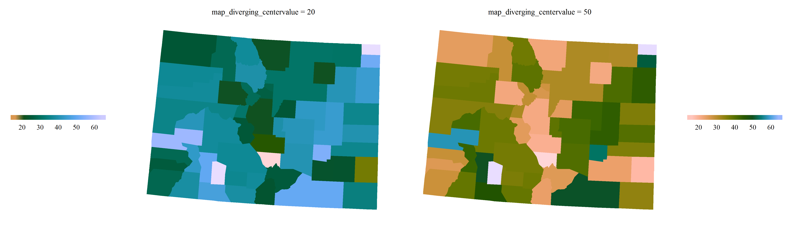

This functionality is integrated into the main mapping functions with the use of a 'histogram' parameter. When set to TRUE, the histogram will be placed at the bottom of the map, with the same limits and scaling as the map. To modify the histogram or its position, users can generate the histogram separately, using the function histogram\_colorstats(), and modify the placements and formatting of the histogram as desired.

``` r
RasterMap(coords=county_pixels[state_name=="Colorado"], id="cnty", xcol="x_albers", ycol="y_albers",
          data=county_simulated, variable="var3", map_colors=wpal("seaglass"),
          legend_position="left", legend_orientation="vertical", font_size=8,
          map_title="Simulated Data Distribution", legend_bar_length=unit(.5,"snpc"),
          histogram=T)
```

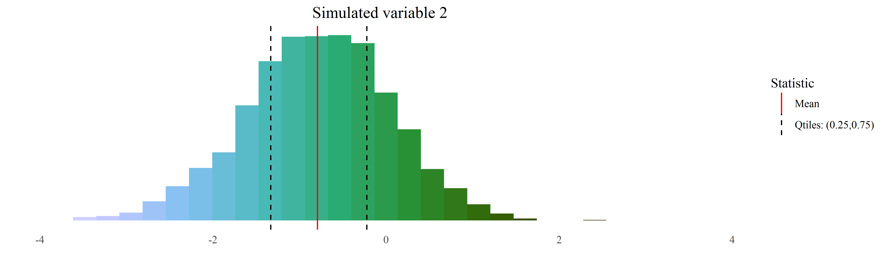
<p class="caption">
A map with a histogram of the data distribution
</p>

Encourage the eye to compare different pieces of data: visualizing by subgroup or time
--------------------------------------------------------------------------------------

Even vast quantities of data (often referred to as "big data") can often be parsed into smaller, more illuminating subgroups. To map the same variable with repeated measurements in different time points, mapping software programs often require that these data are formatted "wide," such that each version of that variable is in its own separate column. Big, multi-dimensional data structures (such as a mortality rate by age, sex, and year) do not fit well in this paradigm. A more sensible structure (often used in data analysis) is the "long" format, where (i) the data identifiers or primary keys (such as the geometry's ID variable, age, sex, and time) each are represented as columns in a data set, and (ii) there is only one column for each variable of interest (available in different combinations of age, sex, and time).

Maintaining a consistent color classification scheme across these subgroups is a crucial part of comparing and contrasting the data. As Monmonier notes, "just as cut-points (data classification schemes) can be manipulated...pairs of choropleth maps can purposely heighten or suppress perceptions of bivariate association"\[22\]. **MapSuite**'s mapping functions make this easy. By defining a column in the external data set as the 'series dimension' of the data, or the dimension of the data (for example, time or age) that you wish to iterate over, the functions will produce a series of maps. These maps will have the same ranges by default (consistent colors applied to each subset of the data based on the minimum and maximum of the observed data across all dimensions). If desired, the ranges used to produce the color scheme can be generated for each subset, by setting the map\_colors\_limits parameter to "each\_dimension". One can restrict the quantity of maps made (if you are only interested in certain sub-groups of the data represented in the external data frame), providing a 'series sequence' that will restrict the loop of maps made to only the specified levels. By default, a subtitle will be generated that is the specific level or dimension of the data that is being mapped. For example, if the variable as the series dimension is 'year', the subtitle for each map would change to represent the specific time period represented in the graphic. When a series dimension is provided, text entered into the 'subtitle' parameter will serve as the prefix for the automatically generated generated subtitle based on the levels of the data that are being mapped.

``` r
PolygonMap(map=colorado, id="cnty", data=county_simulated_time,
            variable="var3", series_dimension="year",series_sequence=c(2000,2005,2009),
            map_colors = wpal("berries"), legend_position = "right",
            legend_orientation= "vertical", map_subtitle="Year: ", map_title="Var 3")
```


<p class="caption">
Three plots with standardized color schemes output from visualizing a time series. For the purposes of this illustration, these plots have been aligned horizontally, but would usually appear in separate plots.
</p>

If the data contains more than one dimension (such as age, sex, and time), a series of loops can be structured such that the data is subset, and plots can be created. To quickly create a PDF of maps of the variable, designate a PDF path, and a .pdf of the maps will be generated rather than printing the plot results to the screen or other viewport.

``` r
for(a in ages){
  for(s in sexes){
    PolygonMap(map=county_polygons, id="cnty", data=county_simulated_time[age==a&sex==s],
               variable="var3", series_dimension="year",
               map_subtitle="Year: ", pdf_path = paste0("var3",a,s,".pdf"))
  }
}
```

To generate a series of complex plots in which some or all of the variables change over time or another dimension, a loop can be constructed to generate plots based on each subset of the data, combined with other map elements, such as a constant background map.

``` r
background<-PolygonMap(map=county_polygons, id="cnty",return_objects = T)$map

time_series<-PointMap(map=county_centroids, id="cnty", data=county_simulated, 
                      id="cnty", xcol="x_albers", ycol="y_albers",
                      variable="var2",series_dimension = "year")

for(y in county_simulated$year){
  map<-StackMaps(maps=list(background,time_series$map[y]),map_title="Layering Maps")
  legends<-StackLegends(legends=polys$map[y])

  grid.newpage()
  print(map, vp = vplayout(1, 1)); print(legends, vp = vplayout(1, 2))
}
```

Summary and further work
------------------------

A number of packages exist to visualize spatial data in R. The MapSuite package attempts to fill a niche that has the advantages of simplicity of use and graphic design, while remaining highly customizable for the more advanced user. Possible extensions and opportunities for future work on this package are the inclusion of line geometries, and the further development of functions and sensible default settings for legends that allow the stacking of map layers with even lower overhead. Interested users are invited to contribute to this effort on [GitHub](https:\github.com\RebeccaStubbs\MapSuite), where the full source code can be found.

References
==========

1
: R. Sieber. Public participation geographic information systems: A literature review and framework. Annals of the Association of American Geographers, 96(3):491-507, 2006. doi: 10.1111/j.1467-8306.2006. 00702.x.

2
: S. Steiniger and E. Bocher. An overview on current free and open source desktop gis developments.International Journal of Geographical Information Science, 23(10):1345-1370, 2009. doi: 10.1080/13658810802634956.

3
: R Core Team. R: A Language and Environment for Statistical Computing. R Foundation for Statistical Computing, Vienna, Austria, 2012. URL <http://www.R-project.org/>. ISBN 3-900051-07-0.

4
: R. B. Pebesma, E.J. Classes and methods for spatial data in r, 2005. URL <https://cran.r-project.org/doc/Rnews/>.

5
: R. Sieber. Public participation geographic information systems: A literature review and framework. Annals of the Association of American Geographers, 96(3):491-507, 2006. doi: 10.1111/j.1467-8306.2006. 00702.x.

6
: H. Wickham. ggplot2: Elegant Graphics for Data Analysis. Springer-Verlag New York, 2009. ISBN 978-0-387-98140-6. URL <http://ggplot2.org>.

7
: D. Kahle and H. Wickham. ggmap: Spatial visualization with ggplot2. The R Journal, 5(1):144-161, 2013. URL <http://journal.r-project.org/archive/2013-1/kahle-wickham.pdf>.

8
: D. Dunnington. ggspatial: Spatial Data Framework for ggplot2, 2017. URL <https://CRAN.R-project.org/package=ggspatial>. R package version 0.2.1.

9
: T. G. U. RIATE. rCarto: This package builds maps with a full cartographic layout., 2013. URL <https://CRAN.R-project.org/package=rCarto>. R package version 0.8.

10
: A. Lamstein and B. P. Johnson. choroplethr: Simplify the Creation of Choropleth Maps in R, 2017. URL <https://CRAN.R-project.org/package=choroplethr>. R package version 3.5.3.

11
: J. Cheng, B. Karambelkar, and Y. Xie. leaflet: Create Interactive Web Maps with the JavaScript 'Leaflet' Library, 2017. URL <https://CRAN.R-project.org/package=leaflet>. R package version 1.1.0.

12
: W. Chang, J. Cheng, J. Allaire, Y. Xie, and J. McPherson. shiny: Web Application Framework for R, 2017.URL <https://CRAN.R-project.org/package=shiny>. R package version 1.0.0.

13
: H.Wickham. A layered grammar of graphics. Journal of Computational and Graphical Statistics, 19(1):3-28, 2010. doi: 10.1198/jcgs.2009.07098.

14
: E. R. Tufte. The Visual Display of Quantitative Information. Graphics Press, 2 edition, 2001.

15
: J. Tyner. Principles of map design. Guilford, 2014.

16
: J. A. Tyner. Persuasive cartography. Journal of Geography, 81(4):140-144, 1982. doi: 10.1080/00221348208980868.

17
: A. Light and P. J. Bartlein. The end of the rainbow? color schemes for improved data graphics, Jun 2011.

18
: C. A. Brewer, A. M. Maceachren, L. W. Pickle, and D. Herrmann. Mapping mortality: Evaluating color schemes for choropleth maps. Annals of the Association of American Geographers, 87(3):411-438, 1997. doi: 10.1111/1467-8306.00061.

19
: E. Neuwirth. RColorBrewer: ColorBrewer Palettes, 2014. URL <https://CRAN.R-project.org/package=RColorBrewer>. R package version 1.1-2.

20
: D. A. Green. A colour scheme for the display of astronomical intensity images. Bulletin of the Astromical Society of India, 39:289-295, Jun 2011.

21
: R. Evans. rje: Miscellaneous useful functions, 2014. URL <https://CRAN.R-project.org/package=rje>. R package version 1.9.

22
: M. Monmonier. Lying with maps. Statistical Science, 20(3):215-222, 2005. doi: 10.1214/088342305000000241.

Appendix 1: The Woodson Color Palettes
--------------------------------------

``` r
ViewPal(color=NULL, n=9, base_size = 7, listcolors=F, n_per_page=9, labelcolors=F)
```

    ## [1] "No color specified; plotting all colors"


